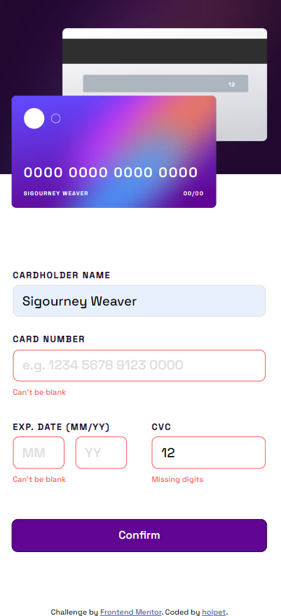

# Frontend Mentor - Interactive card details form solution

This is a solution to the [Interactive card details form challenge on Frontend Mentor](https://www.frontendmentor.io/challenges/interactive-card-details-form-XpS8cKZDWw).

### The challenge

Users are able to:

- Fill in the form and see the card details update in real-time
- Receive error messages when the form is submitted if:
  - Any input field is empty
  - The name contains number or any special characters
  - The card number, expiry date, or CVC fields are in the wrong format / missing digits
  - The expiry date is expired
- View the optimal layout depending on their device's screen size
- See hover, active, and focus states for interactive elements on the page

### Links

- Live Site URL: [Add live site URL here](https://your-live-site-url.com)

## My process

### Built with

- Semantic HTML5 markup
- CSS custom properties with Sass
- Grid, Flexbox
- Mobile-first workflow
- [React](https://reactjs.org/) - JS library with Vite build

### Useful resources & notes

There are two listeners - one for window width and one for components height, which help with adjusting the design during resizing. Maybe that's a bit of an overkill?

- [React Doc](https://legacy.reactjs.org/docs/hooks-faq.html#how-can-i-measure-a-dom-node) - This helped me with creating a custom hook and using a reference with a callback function.
- [Jest config](https://egghead.io/lessons/jest-adding-jest-with-typescript-support-to-a-vite-application) - How to add Jest to Vite, which doesn't natively support testing. // + babel.config.cjs

## How to install & run

First, run the development server:

```bash
npm install
npm run dev
# or
yarn install
yarn dev
```

### Screenshots

## Desktop version:


## Mobile version:



